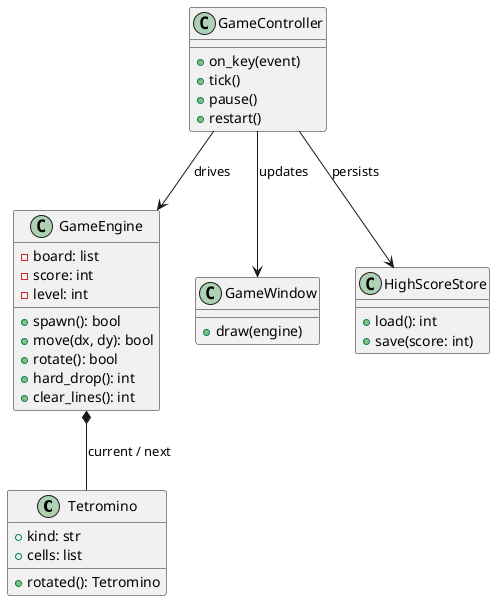
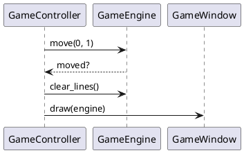
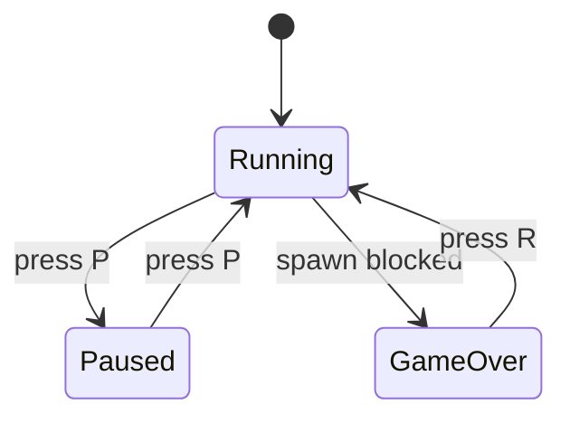

# Architecture Views

## Class Diagram

```plantuml
@startuml
class Tetromino {
  +kind: str
  +cells: list
  +rotated(): Tetromino
}
class GameEngine {
  -board: list
  -score: int
  -level: int
  +spawn(): bool
  +move(dx, dy): bool
  +rotate(): bool
  +hard_drop(): int
  +clear_lines(): int
}
class GameController {
  +on_key(event)
  +tick()
  +pause()
  +restart()
}
class GameWindow {
  +draw(engine)
}
class HighScoreStore {
  +load(): int
  +save(score: int)
}
GameController --> GameEngine : drives
GameController --> GameWindow : updates
GameEngine *-- Tetromino : current / next
GameController --> HighScoreStore : persists
@enduml
```

## Sequence Diagram - Gravity tick

```plantuml
@startuml
participant GameController
participant GameEngine
participant GameWindow
GameController -> GameEngine : move(0, 1)
GameEngine --> GameController : moved?
GameController -> GameEngine : clear_lines()
GameController -> GameWindow : draw(engine)
@enduml
```

## State Diagram - Game lifecycle

```mermaid
stateDiagram-v2
    [*] --> Running
    Running --> Paused : press P
    Paused --> Running : press P
    Running --> GameOver : spawn blocked
    GameOver --> Running : press R
```
